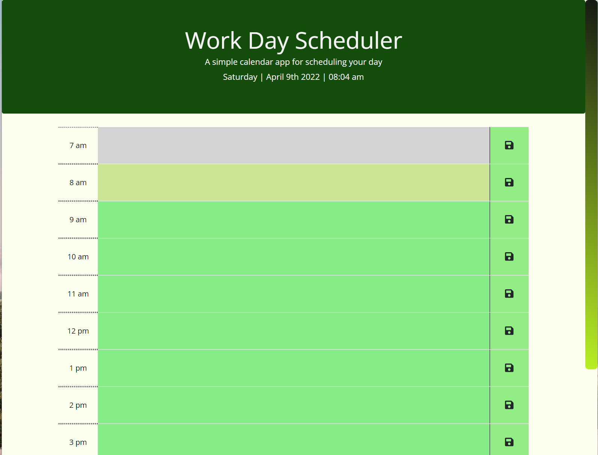
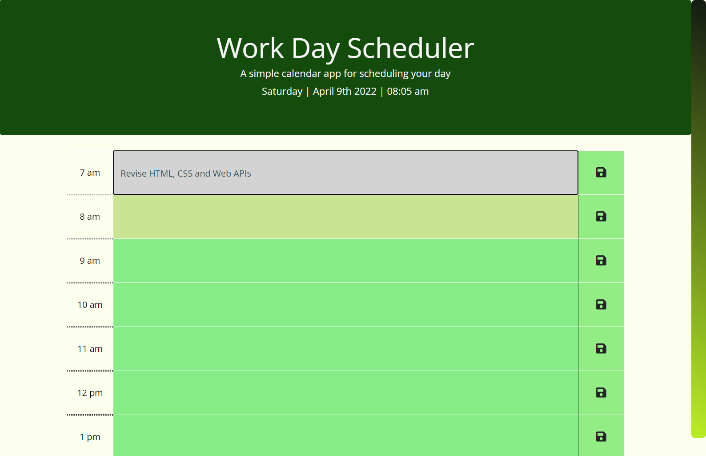
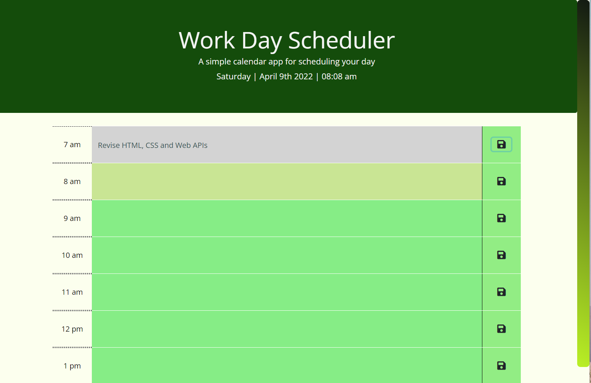
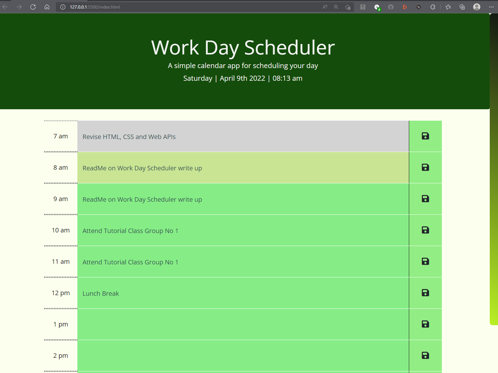
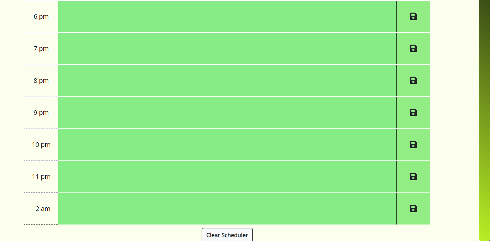

## TASK
The task here is to create a simple calendar application that allows a user like me to save my daily schedule between the time of 7am to 12 am (midnight) including important events to manage my time effectively.  This app will run in the browser and feature HTML, CSS powered by jQuery.  Reference is also made to moment.js for the time and date format.

The application is deployed on GitHub and the repository name is  as the quiz is on testing Javascript fundamentals.


## ACCEPTANCE CRITERIA

The steps taken to meet the acceptance criteria of:-

```
GIVEN I am using a daily planner to create a schedule
WHEN I open the planner
THEN the current day is displayed at the top of the calendar
WHEN I scroll down
THEN I am presented with timeblocks for standard business hours
WHEN I view the timeblocks for that day
THEN each timeblock is color coded to indicate whether it is in the past, present, or future
WHEN I click into a timeblock
THEN I can enter an event
WHEN I click the save button for that timeblock
THEN the text for that event is saved in local storage
WHEN I refresh the page
THEN the saved events persist
```
1)  In the WORK_DAY_SCHEDULER folder , I have created or modified the following files:-

    * index.html - adding comments.
    * style.css - adding comments and custom scrollbars.  I have modified the original style.css to add custom colors.
    * script.js - for carrying out the functions to meet the required criteria.


2) The below screenshots show the process the users would go through in recording the events or activities for the day so that they can plan or manage their time effectively.


#### <em>Overview of the Work Day Planner</em> 
    The current date and time is displayed at the top of the calendar.  The timeblocks are the standard business hours of 7am to 11 pm as we normally work or study during these hours.

    *grey - the past event or activity
    *the different shades of green - the present and future event or activity



#### <em>Recording or entering event or activity in the timeblock</em> 
     The user click on the timeblock to enter their activities or events. 



#### <em>Saving the entries or activities for the timeblock</em>
     The user click on the save button for theat timeblock for the event to be saved in local storage.  
    


#### <em>Refresh the page and the saved events persist</em>
     When the page is refreshed,  the entries or events persist.


#### <em>Clear the previous events or entries<em>
     The user can also clear the entries for a fresh start.

    


## DEPLOYMENT

The URL of the GitHub respository is :-

https://github.com/stellalph/WORK_DAY_SCHEDULER.git

The URL of the functional, deployed application is :-

https://stellalph.github.io/WORK_DAY_SCHEDULER/


## REFERENCES (other)

* The materials from The Unit Ahead: Third-Party APIs


